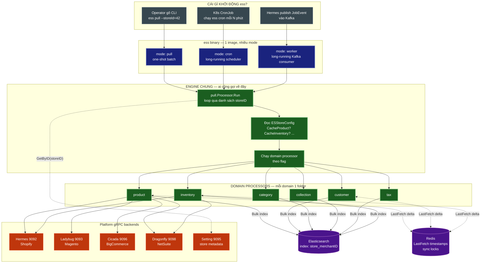
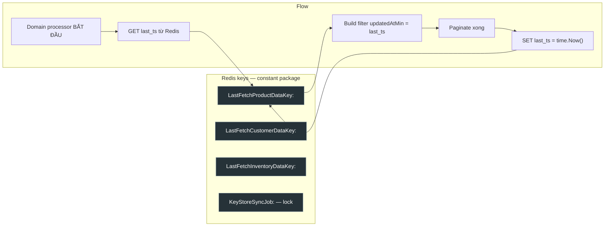
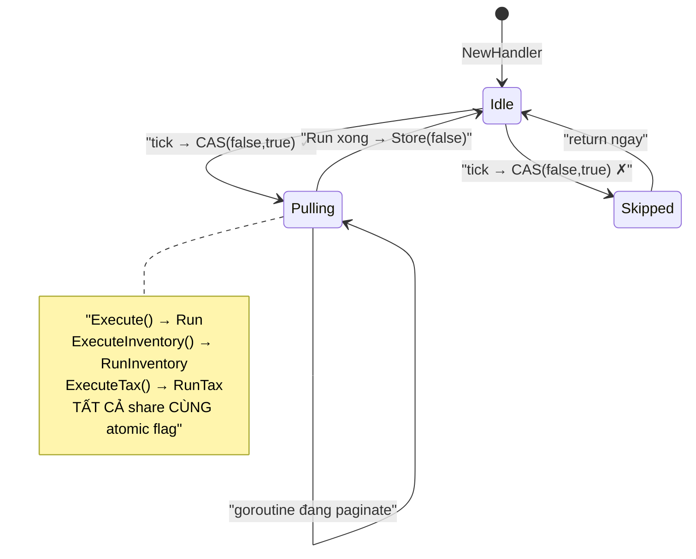
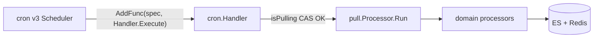
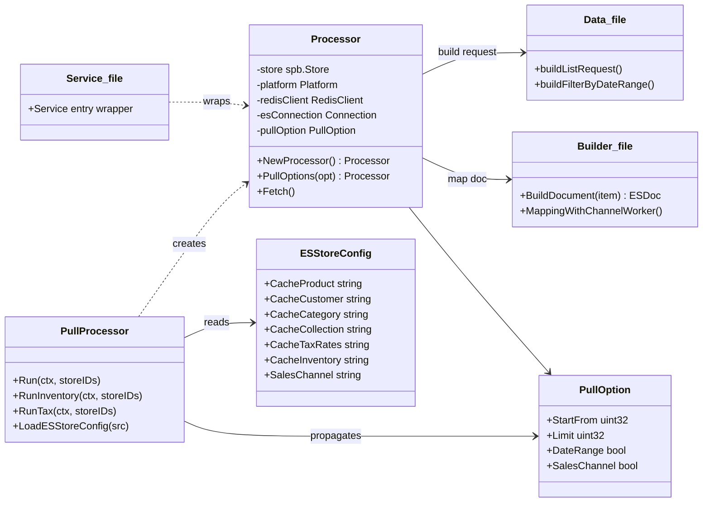
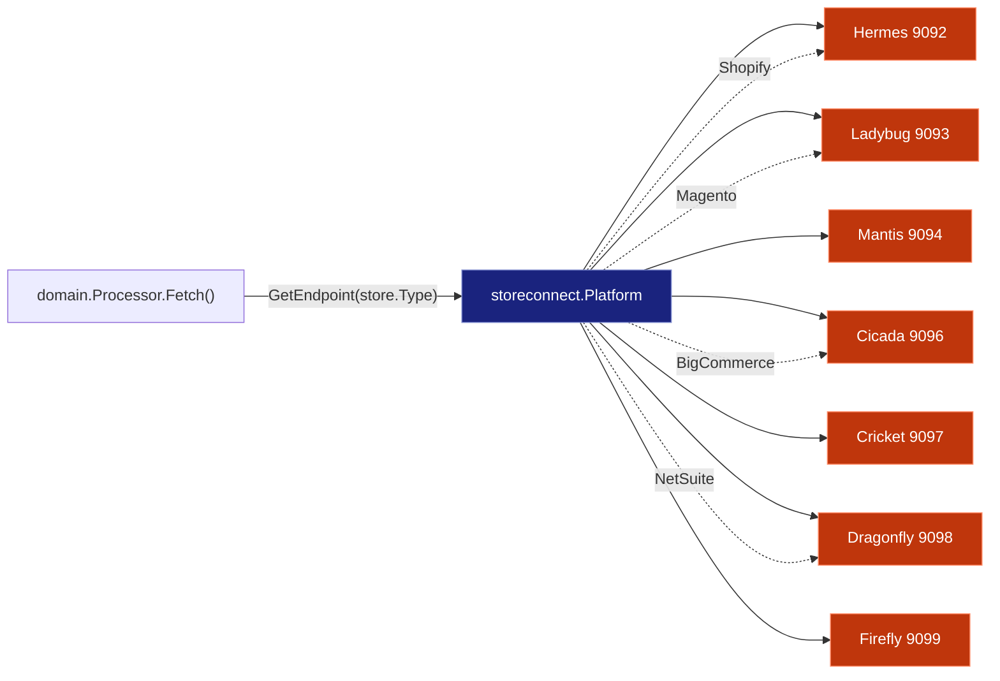
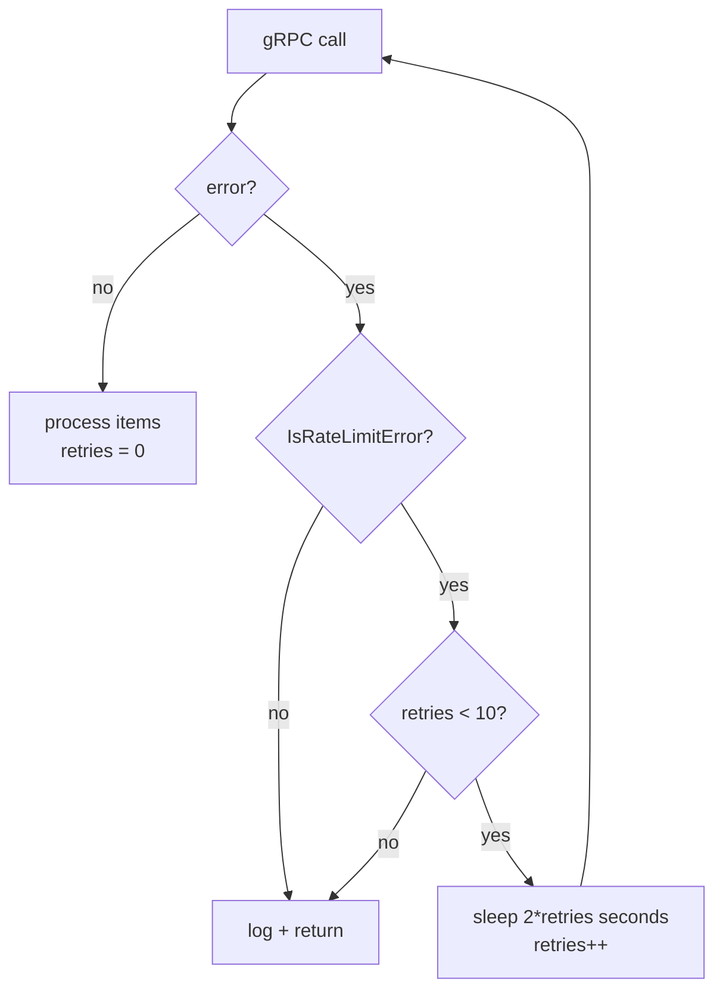
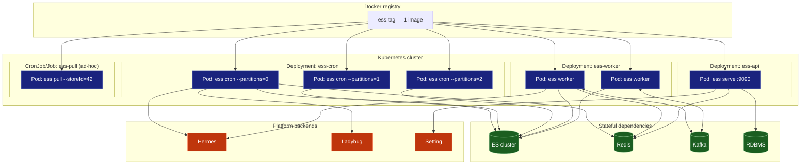

# elastic-search-service — Architecture Guide (v1)

> **Đọc trước khi code**. Tài liệu này giải thích toàn bộ flow của `es/elastic-search-service/` từ zero → hiểu được mọi nhánh xử lý.
> Target audience: Go engineer mới join team, cần hiểu "dữ liệu đi từ Shopify đến Elasticsearch như thế nào".

---

## 0. Câu chuyện 30 giây

ConnectPOS cần **search nhanh** trên sản phẩm / khách hàng / tồn kho của hàng chục nghìn store. Gọi trực tiếp Shopify API mỗi lần search = chậm + rate-limit. Giải pháp: **copy dữ liệu từ Shopify về Elasticsearch local**, search ES thay vì search Shopify.

Service `elastic-search-service` (gọi tắt **ess**) chính là cái **"máy copy"** đó. Nó:

1. Hỏi Setting service: "Store 42 cấu hình thế nào?"
2. Gọi Hermes (hoặc backend tương ứng) để lấy data Shopify
3. Chuyển đổi sang document ES
4. Bulk index vào Elasticsearch theo index `store_42`
5. Lưu timestamp vào Redis để lần sau chỉ lấy phần thay đổi (delta sync)

Đơn giản vậy. Phần còn lại của doc này là chi tiết **"nó làm cái đó theo 3 cách khác nhau và tại sao"**.

---

## 1. Big Picture — Một hình thôi



**3 câu cần nhớ từ hình này:**

1. **3 trigger, 1 engine**: CLI, Cron, Kafka đều đi về `pull.Processor.Run` (hoặc `SyncWorker` cho Kafka — nhưng cùng logic paginate + bulk).
2. **Flag-gated per store**: `ESStoreConfig.CacheProduct = "false"` → bỏ qua product cho store đó. Không cần deploy lại.
3. **Backend routing theo `store.Type`**: `platform.GetEndpoint(store.Type)` trả endpoint khác nhau cho Shopify / Magento / BigCommerce / NetSuite.

---

## 2. Cấu trúc thư mục — Cái gì ở đâu

```
elastic-search-service/
│
├── main.go                     ← cobra.Execute, 1 dòng
├── cmd/                        ← ENTRYPOINTS (mỗi file = 1 subcommand)
│   ├── root.go                 ← viper + logger init
│   ├── pull.go                 ← ★ mode batch one-shot
│   ├── cron.go                 ← ★ mode scheduler dài hạn
│   ├── worker.go               ← placeholder (logic ở internal/worker/sync.go)
│   ├── serve.go / grpc.go      ← mode API server
│   ├── rest.go                 ← REST handlers
│   ├── sync.go / inventory.go  ← manual trigger 1 domain
│   └── migrate.go              ← DB schema migration
│
├── internal/
│   ├── config/                 ← ES config, Redis client, DB conn, instance
│   ├── constant/               ← index names, redis keys, kafka topics, paging
│   ├── base/client.go          ← helper build client data cho gRPC call
│   ├── dto/                    ← PullOption, SyncJob DTO
│   ├── broker/kafka.go         ← tạo kafka-go Reader
│   ├── message/worker.go       ← JobEvent struct
│   ├── model/                  ← Store, SyncJob, GetStoreIDs
│   ├── migration/              ← schema versions
│   ├── repositories/sync_job/  ← DB access layer
│   │
│   ├── pull/                   ← ★★ ORCHESTRATION LAYER
│   │   ├── processor.go        ← Run / RunInventory / RunTax
│   │   ├── struct.go           ← ESStoreConfig
│   │   └── data.go             ← config parsing helpers
│   │
│   ├── cron/handler.go         ← ★ Handler với isPulling atomic.Bool guard
│   │
│   ├── worker/sync.go          ← ★ SyncWorker đọc Kafka → SyncProduct / SyncInventory
│   │
│   └── services/               ← ★★ DOMAIN LAYER (4-file pattern)
│       ├── product/
│       │   ├── service.go      ← entry/wiring
│       │   ├── processor.go    ← pagination loop + gRPC call
│       │   ├── builder.go      ← map proto → ES document
│       │   ├── data.go         ← build request filter
│       │   └── worker.go       ← mapping helpers (sales channel, etc.)
│       ├── customer/     (4 file tương tự)
│       ├── category/     (4 file tương tự)
│       ├── collection/   (thêm prepaprer.go + smart collection)
│       ├── tax/          (4 file tương tự)
│       ├── inventory/    (4 file tương tự)
│       ├── customer_group/
│       └── job/          ← sync_job service + prepare
│
├── pkg/
│   ├── context/signal.go       ← WithInterruptSignal — ctrl+C handling
│   └── cpos_log/               ← logrus wrapper có store context
│
├── util/                       ← retry, rate-limit detect, pull options, strings
└── Makefile
```

**Rule of thumb**:
- Thêm **mode mới** (vd `ess backfill`) → tạo file trong `cmd/`
- Thêm **domain mới** (vd `discount`) → tạo folder trong `internal/services/<name>/` với 4 file + thêm nhánh `if` trong `internal/pull/processor.go`
- Thêm **backend mới** (vd Woo) → thêm field vào `storeconnect.Platform` + map trong `GetEndpoint`

---

## 3. Mode `pull` — Batch one-shot

### 3.1 Khi nào dùng?

- Backfill store mới onboard
- Reindex thủ công khi ES cluster mất dữ liệu
- Debug: pull 1 store cụ thể để xem có lỗi gì không

### 3.2 Flow chi tiết

```mermaid
sequenceDiagram
    autonumber
    actor Op as "DevOps"
    participant CLI as "cmd/pull.go<br/>runPullCommand"
    participant Vi as "viper"
    participant SC as "StoreClient"
    participant PP as "pull.Processor"
    participant ESC as "ESStoreConfig"
    participant Prod as "product.Processor"
    participant Cust as "customer.Processor"
    participant Inv as "inventory.Processor"
    participant Rd as "Redis"
    participant Grpc as "Hermes gRPC"
    participant ES as "Elasticsearch"

    Op->>CLI: "ess pull --storeId=42 --all=false --source=prod"
    CLI->>Vi: "bind flags: redis, es, hermes, ladybug..."
    CLI->>CLI: "build Platform map + ESConfig + RedisClient"
    CLI->>SC: "NewStoreClient(settingEndpoint)"
    CLI->>PP: "NewProcessor(esCfg, redis, storeCli, platform)"
    CLI->>PP: ".PullOptions(InitPullOptions(startFrom, limit, !fetchAll))"
    CLI->>PP: ".LoadESStoreConfig(source)"

    Note over CLI,PP: "storeID != 0 → chạy 1 store<br/>storeID == 0 → model.GetStoreIDs(partitions)"

    CLI->>PP: "Run(ctx, [42])"
    PP->>SC: "GetByID('42')"
    SC-->>PP: "store (type, configs, channel)"
    PP->>ESC: "GetESStoreConfig(store.Configs)"
    ESC-->>PP: "Cache flags per domain"

    rect rgb(30, 60, 90)
        Note over PP,ES: "Nhánh Product — chạy nếu CacheProduct != 'false'"
        PP->>Prod: "NewProcessor + PullOptions + Fetch"
        Prod->>Rd: "GET LastFetchProductDataKey:42"
        Rd-->>Prod: "updatedAtMin (ISO timestamp)"
        Prod->>Grpc: "grpc.Dial(platform.GetEndpoint(Shopify))"
        loop "page = startFrom; until no next page"
            Prod->>Grpc: "ProductService.GetList(filter{page, updatedAtMin})"
            Grpc-->>Prod: "{Items, NextPageInfo}"
            alt "rate limited error"
                Prod->>Prod: "sleep(2*retries); retries++"
            else "ok"
                Prod->>Prod: "builder.go: map proto → ES doc"
                Prod->>ES: "esConnection.Product.Bulk(items)"
                Prod->>Prod: "page++, filter.PageInfo = result.NextPageInfo"
            end
        end
        Prod->>Rd: "SET LastFetchProductDataKey:42 = now"
    end

    rect rgb(60, 30, 60)
        Note over PP,ES: "Nhánh Customer, Category, Collection, Tax — tương tự"
        PP->>Cust: "Fetch()"
        Cust->>Grpc: "CustomerService.GetList"
        Cust->>ES: "Customer.Bulk"
    end

    rect rgb(30, 60, 30)
        Note over PP,ES: "Nhánh Inventory — chỉ chạy nếu CacheInventory == 'true'"
        PP->>Inv: "Fetch(ctx)"
        Inv->>Grpc: "InventoryItemService.GetList"
        Inv->>ES: "Inventory.Bulk"
    end

    PP-->>CLI: "done"
    CLI-->>Op: "'pull successful' + os.Exit(0)"
```

### 3.3 Các flag quan trọng của `pull`

| Flag | Default | Ý nghĩa |
|---|---|---|
| `--storeId` | `` | 1 store cụ thể. Nếu empty → chạy toàn bộ store theo partition |
| `--all` | `true` | `true`: full sync (bỏ qua `updatedAtMin`). `false`: delta sync |
| `--startFrom` | `1` | Bắt đầu từ page N (resume pull dở) |
| `--limit` | `100` | Items per page (gRPC) |
| `--partitions` | `0` | Shard stores theo partition ID — chạy song song nhiều pod |
| `--source` | `` | Override `ESStoreConfig` cho tất cả store (debug) |
| `--hermes`, `--ladybug`, ... | 127.0.0.1:909x | Endpoint các backend |

### 3.3b Command line mẫu

**Force sync 1 store (hay dùng nhất khi ops cần sync gấp):**
```bash
./elastic-search-service pull \
  --storeId=5981 \
  --source=inventory \
  --redisAddressRead=127.0.0.1:6379 \
  --redisAddressWrite=127.0.0.1:6379 \
  --redisPassword=yourpassword \
  --esAddress=http://127.0.0.1:9200 \
  --esUsername=elastic \
  --esPassword=yourpassword \
  --hermes=127.0.0.1:9092 \
  --setting=127.0.0.1:9095
```

**Full resync 1 store (bỏ qua delta, pull lại hết từ đầu):**
```bash
./elastic-search-service pull \
  --storeId=5981 \
  --all=true \
  --redisAddressRead=127.0.0.1:6379 \
  --redisAddressWrite=127.0.0.1:6379 \
  --esAddress=http://127.0.0.1:9200 \
  --hermes=127.0.0.1:9092 \
  --setting=127.0.0.1:9095
```

**Pull cả partition (production pod):**
```bash
./elastic-search-service pull \
  --partitions=1 \
  --redisAddressRead=127.0.0.1:6379 \
  --redisAddressWrite=127.0.0.1:6379 \
  --esAddress=http://127.0.0.1:9200 \
  --hermes=127.0.0.1:9092 \
  --setting=127.0.0.1:9095
```

**Chạy cron daemon dài hạn (production):**
```bash
./elastic-search-service cron \
  --partitions=1 \
  --redisAddressRead=127.0.0.1:6379 \
  --redisAddressWrite=127.0.0.1:6379 \
  --esAddress=http://127.0.0.1:9200 \
  --hermes=127.0.0.1:9092 \
  --setting=127.0.0.1:9095
```

> **Ghi chú**: `pull` chạy xong thì exit. `cron` chạy mãi đến khi nhận SIGTERM/SIGINT.

### 3.4 Delta sync — Cái gì nằm ở đâu



**Nhớ**: nếu `pullOption.DateRange == false` → `filter.UpdatedAtMin = ""` → full resync. Đây là effect của `--all=true`.

---

## 4. Mode `cron` — Scheduler dài hạn

### 4.1 Khác gì `pull`?

- `pull` chạy xong thì exit
- `cron` chạy mãi, tick theo `robfig/cron/v3` expression
- Có **single-flight guard** — `atomic.Bool` chặn tick đè lên tick

### 4.2 Handler state machine



**Tại sao quan trọng**: store lớn có thể pull 30 phút. Nếu cron tick mỗi 5 phút mà không guard → 6 goroutine chạy song song trên cùng store → rate-limit Shopify + ghi đè nhau trong ES.

Code: `internal/cron/handler.go:50-69`.

### 4.3 Wiring cron → handler → processor



---

## 5. Mode `worker` — Kafka reactive sync

### 5.1 Ý tưởng

- `pull` và `cron` là **"lịch"** (polling model)
- `worker` là **"sự kiện"** (push model): khi có thay đổi ở Hermes, publish event → ess re-sync chỉ store đó

### 5.2 Flow đầy đủ

```mermaid
sequenceDiagram
    autonumber
    participant H as "Hermes"
    participant K as "Kafka topic"
    participant R as "kafka.Reader"
    participant SW as "SyncWorker"
    participant St as "StoreClient"
    participant Rd as "Redis"
    participant G as "Platform gRPC"
    participant ES as "Elasticsearch"

    H->>K: "produce JobEvent{StoreId, JobId, Type}"

    loop "forever"
        SW->>R: "ReadMessage(ctx)"
        R-->>SW: "msg.Value (proto bytes)"
        SW->>SW: "proto.Unmarshal → jobPb.JobEvent"

        alt "Type == SyncProduct"
            SW->>SW: "go SyncProduct(storeId, jobId)"
            activate SW
            SW->>St: "GetByID(storeId)"
            St-->>SW: "store"
            SW->>G: "grpc.Dial(platform.GetEndpoint(store.Type))"
            loop "paginate"
                SW->>G: "ProductService.GetList(page, viewId)"
                alt "rate-limited"
                    SW->>SW: "sleep(2*retries); retries++ (max 10)"
                else "ok"
                    G-->>SW: "items + nextPageInfo"
                    opt "BigCommerce + sales channel"
                        SW->>G: "MappingWithChannelWorker"
                    end
                    SW->>ES: "Product.Bulk"
                end
            end
            SW->>Rd: "DEL KeyStoreSyncJob:storeId (defer)"
            deactivate SW
        else "Type == SyncInventory"
            SW->>SW: "go SyncInventory(storeId, jobId)"
            activate SW
            alt "store.Type == NetSuite"
                alt "countItems <= 100_000"
                    SW->>G: "UpsertInventoryWorker(filter)"
                else "> 100_000 items"
                    SW->>G: "LocationService.GetList"
                    loop "each location"
                        SW->>G: "UpsertInventoryWorker(filter + locationId)"
                    end
                end
            else "Shopify / others"
                loop "paginate"
                    SW->>G: "InventoryItemService.GetList"
                    SW->>ES: "Inventory.Bulk"
                end
            end
            SW->>Rd: "DEL KeyStoreSyncJob:storeId (defer)"
            deactivate SW
        end
    end
```

### 5.3 NetSuite special-case (tại sao riêng)

- Shopify/Magento: paginate tuyến tính theo `page` / `page_info` → OK với mọi size
- NetSuite: API trả `CountItems` tổng trước khi pagination window đủ lớn. Nếu store có `> 100_000` inventory items → paginate thường sẽ không convergence
- Fix: fan-out theo `location_id` (mỗi location sync độc lập)
- Code: `internal/worker/sync.go:355-431` — method `fetchInventoryInNetSuite`

### 5.4 Sync lock qua Redis

Key `KeyStoreSyncJob:<storeId>` dùng làm lock — set khi start, `DEL` khi done (defer). Publisher (Hermes) kiểm tra key này để không publish trùng job cho store đang sync.

---

## 6. Domain Processor — 4-file pattern

Mỗi domain (`product`, `customer`, ...) tổ chức 4 file cố định. Học 1 domain = hiểu tất cả.

### 6.1 Class diagram



### 6.2 Trách nhiệm từng file

| File | Chỉ được phép làm | Không được làm |
|---|---|---|
| `service.go` | Entry/wiring, thoả interface contract | Pagination, gRPC call |
| `processor.go` | Pagination loop, gRPC call, retry, bulk index | Field mapping chi tiết |
| `builder.go` | Map proto message → ES document | gRPC call, đọc Redis |
| `data.go` | Build `ListRequest` filter, query options | Gọi API |

**Nếu vi phạm layer** (ví dụ `builder.go` gọi gRPC) → code review sẽ reject. Đây là convention xuyên suốt repo.

### 6.3 Thêm domain mới — 5 bước

1. Tạo folder `internal/services/<name>/`
2. Copy 4 file từ `product/` làm template → đổi type
3. Thêm field `Cache<Name>` vào `ESStoreConfig` (file `internal/pull/struct.go`)
4. Thêm nhánh `if` trong `pull.Processor.Run`:
   ```go
   if "false" != esStoreConfig.Cache<Name> {
       <name>.NewProcessor(store, p.redisClient, esConnection, p.platform).
           PullOptions(p.pullOption).Fetch()
   }
   ```
5. Thêm index name vào `internal/constant/index.go`

---

## 7. Platform fan-out — Multi-backend routing

### 7.1 Vấn đề

ConnectPOS hỗ trợ nhiều nền tảng POS: Shopify, Magento, BigCommerce, NetSuite, ... Mỗi nền tảng có 1 backend gRPC riêng (Hermes, Ladybug, Cicada, Dragonfly, ...). ess cần gọi đúng backend theo loại store.

### 7.2 Giải pháp



Tất cả endpoint được viper bind từ CLI flag (`--hermes`, `--ladybug`, ...). Khi deploy K8s, các env var override default.

### 7.3 Cách domain processor gọi

```go
maxSize := 100 * 1024 * 1024
diaOpt := grpc.WithDefaultCallOptions(
    grpc.MaxCallRecvMsgSize(maxSize),
    grpc.MaxCallSendMsgSize(maxSize),
)
conn, err := grpc.Dial(
    p.platform.GetEndpoint(p.store.Type), // ← routing happens here
    grpc.WithInsecure(),
    diaOpt,
)
```

`100 MB max message` vì một số store có catalog lớn, payload GetList có thể > 10 MB.

---

## 8. Error handling & retry

### 8.1 Rate limit



Helper: `util.IsRateLimitError(err.Error())` — match string lỗi trả từ Shopify. Backoff tuyến tính (không exponential) vì Shopify có token bucket reset đều đặn.

### 8.2 Context cancellation

`pull` dùng `context2.WithInterruptSignal` (SIGINT/SIGTERM) → khi K8s rolling update gửi SIGTERM, pull hiện tại kết thúc page đang chạy rồi return gracefully.

`cron` và `worker` có ctx riêng — reader sẽ thoát khi `ctx.Err() != nil`.

---

## 9. Deployment — 1 image, nhiều Pod



**Partition shard**: `--partitions=N` trong cron chia storeID theo modulo → mỗi pod chỉ handle 1 tập store → horizontal scale.

---

## 10. Onboarding cheat sheet

### 10.1 "Dữ liệu store 42 không lên ES, debug thế nào?"

1. **Store có exist không?** `storeClient.GetByID("42")` → log "store does not exist"?
2. **Config cho phép sync không?** Xem `store.Configs.Cache<Domain>` — nếu `"false"` thì sẽ skip
3. **LastFetch timestamp quá mới?** Redis `GET LastFetchProductDataKey:42` — nếu gần `now` thì delta sync sẽ không lấy gì. Chạy `ess pull --storeId=42 --all=true`
4. **gRPC backend up?** `nc -zv hermes 9092`
5. **Rate limited?** Check log có `IsRateLimitError` spam không
6. **ES index exist?** `GET store_42/_count`
7. **Sync lock stuck?** Redis `GET KeyStoreSyncJob:42` — nếu có mà process đã crash → `DEL` manually

### 10.2 "Thêm 1 flag CLI mới"

1. Add `Flags().StringP("newFlag", ...)` trong `cmd/<mode>.go:init`
2. `viper.BindPFlag("newFlag", ...)`
3. Đọc trong runner: `viper.GetString("newFlag")`

### 10.3 "Fix race condition cron"

Đọc `internal/cron/handler.go` — `isPulling` phải là `atomic.Bool`, không phải `sync.Mutex` (mutex sẽ block queue tick, atomic thì skip).

### 10.4 "Thêm backend mới (vd Woo)"

1. Add field `Woo string` vào `storeconnect.Platform` (ở repo cockroach/store-connect)
2. Add case trong `GetEndpoint(storeType)`
3. Add `--woo` flag vào mọi file cmd/
4. Add constant `IsWoocommerce` helper
5. Test với 1 domain (product) trước khi rollout

### 10.5 "Tra cứu nhanh"

| Câu hỏi | File |
|---|---|
| Mode nào sync gì? | `internal/pull/processor.go` |
| Config flag tenant? | `internal/pull/struct.go` + `data.go` |
| Redis key constants? | `internal/constant/redis.go` |
| Kafka topic constants? | `internal/constant/kafka.go` |
| Index naming? | `internal/constant/index.go` |
| Rate-limit detection? | `util/error.go` (`IsRateLimitError`) |
| Retry backoff? | `util/retry.go` (`RetryBackoff`) |
| Pagination defaults? | `internal/constant/paging.go` + `util/pull.go` |
| Store type helpers? | `storeconnect` package (bên ngoài repo) |

---

## 11. Glossary

| Từ | Nghĩa |
|---|---|
| **ess** | viết tắt của `elastic-search-service` |
| **Hermes / Ladybug / ...** | gRPC backend service, mỗi cái bridge 1 nền tảng POS |
| **Platform** | struct giữ map endpoint của tất cả backend |
| **Delta sync** | chỉ lấy data có `updated_at > last_fetch` |
| **Full resync** | bỏ qua `updated_at`, lấy toàn bộ |
| **Partition** | modulo shard storeID — horizontal scale |
| **Bulk index** | ES bulk API — ghi nhiều document trong 1 request |
| **Single-flight** | đảm bảo tại 1 thời điểm chỉ có 1 call đang chạy cho 1 key |
| **JobEvent** | proto message trong topic Kafka, trigger reactive sync |
| **ESStoreConfig** | per-tenant feature flags cho ess |
| **CaS** | Compare-and-Swap — atomic operation |

---

## 12. Đọc tiếp cái gì?

- `cmd/pull.go` — hiểu init wiring
- `internal/pull/processor.go` — hiểu orchestration
- `internal/services/product/processor.go` — hiểu 1 domain hoàn chỉnh
- `internal/worker/sync.go` — hiểu Kafka reactive mode
- `internal/cron/handler.go` — 70 dòng, đọc full trong 2 phút
- `CLAUDE.md` root repo — rules migration + testing
