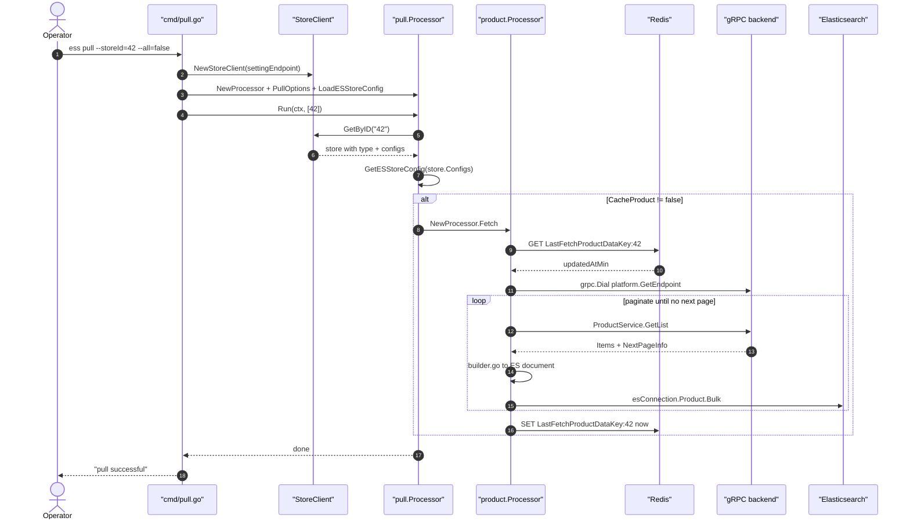
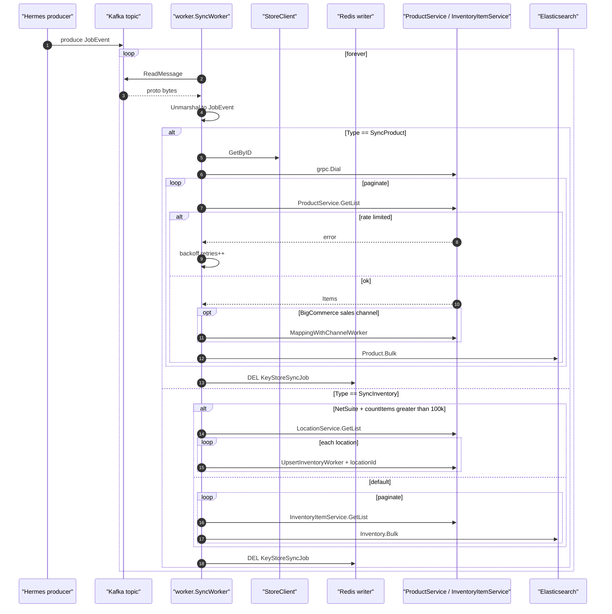
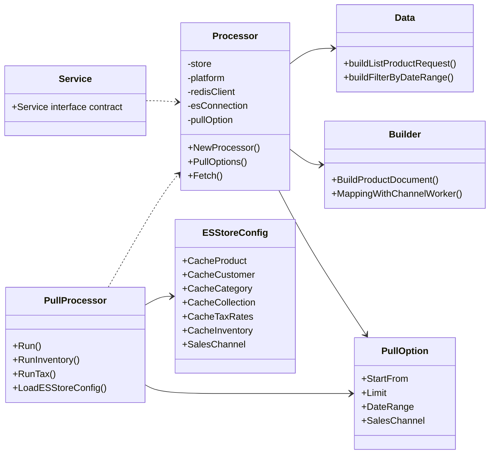
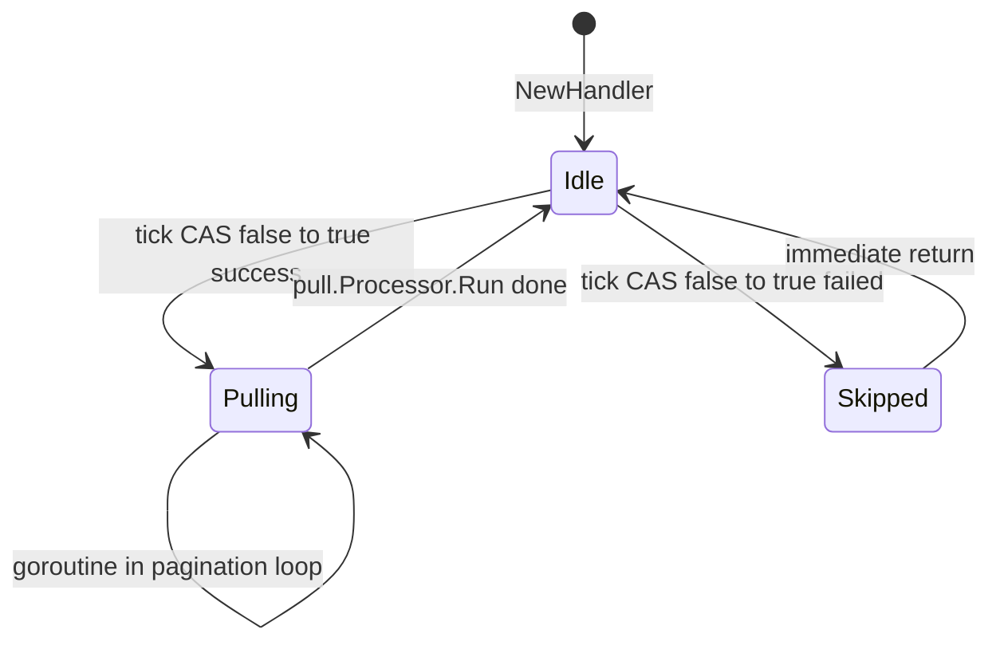
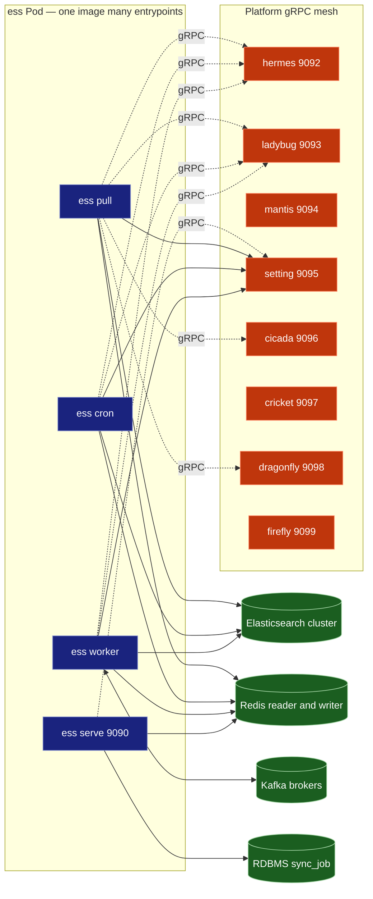

# elastic-search-service — Architecture Guide

> Location: `es/elastic-search-service/`
> Module: `git02.smartosc.com/production/spos/services/elastic-search-service`
> Purpose: Pull dữ liệu từ các platform gRPC backend (Hermes/Ladybug/Mantis/Cicada/...) và index vào Elasticsearch để phục vụ search cho ConnectPOS.

---

## TL;DR

`elastic-search-service` (viết tắt **ess**) là một **Cobra CLI đa-mode**: cùng 1 binary nhưng chạy nhiều entrypoint khác nhau (`pull`, `cron`, `worker`, `serve`, `sync`, `migrate`). Tất cả cuối cùng hội tụ về cùng 1 engine — `internal/pull.Processor` — orchestrate các domain processor (product, customer, category, collection, tax, inventory) theo **flag per-store** lấy từ `storeconnect.StoreClient`.

| Mode | Lifecycle | Trigger | Dùng khi |
|---|---|---|---|
| `pull` | one-shot | CLI / K8s Job | Reindex thủ công, backfill |
| `cron` | long-running | `robfig/cron/v3` tick | Delta sync định kỳ |
| `worker` | long-running | Kafka `JobEvent` | Reactive sync khi Hermes publish job |
| `serve` | long-running | gRPC + REST | Query API cho dashboard |
| `migrate` | one-shot | CLI | Schema migration (`sync_job` table) |

---

## 1. High-level Architecture

```mermaid
flowchart TB
    classDef entry fill:#0d47a1,stroke:#64b5f6,stroke-width:2px,color:#fff
    classDef core fill:#1b5e20,stroke:#81c784,stroke-width:2px,color:#fff
    classDef domain fill:#4a148c,stroke:#ba68c8,stroke-width:1px,color:#fff
    classDef external fill:#e65100,stroke:#ffb74d,stroke-width:2px,color:#fff
    classDef storage fill:#263238,stroke:#78909c,stroke-width:2px,color:#fff

    USER(["Operator / K8s"]):::external
    HERMES_EV(["Hermes Job Publisher"]):::external

    subgraph CLI["cmd — Cobra entrypoints"]
        direction LR
        CMD_PULL["pull.go — one-shot batch"]:::entry
        CMD_CRON["cron.go — robfig cron v3"]:::entry
        CMD_WORKER["worker.go + worker/sync.go"]:::entry
        CMD_SERVE["serve.go / grpc.go / rest.go"]:::entry
        CMD_MIGRATE["migrate.go"]:::entry
    end

    subgraph BOOT["Boot layer — internal/config"]
        VIPER["viper flags + env"]
        REDIS_FACT["RedisClient Reader+Writer"]
        ES_FACT["config.NewESConnection per-merchant"]
        PLAT["storeconnect.Platform endpoint map"]
        STORE_CLI["storeconnect.StoreClient metadata cache"]
    end

    subgraph ORCH["Orchestration — internal/pull"]
        PROCESSOR["pull.Processor — Run / RunInventory / RunTax"]:::core
        ES_CFG["ESStoreConfig — CacheProduct / CacheCustomer / ..."]:::core
        PULL_OPT["dto.PullOption — StartFrom, Limit, DateRange"]:::core
    end

    subgraph DOMAINS["internal/services — 4-file pattern per domain"]
        direction LR
        SVC_P["product"]:::domain
        SVC_C["customer"]:::domain
        SVC_CAT["category"]:::domain
        SVC_COL["collection"]:::domain
        SVC_T["tax"]:::domain
        SVC_INV["inventory"]:::domain
        SVC_CG["customer_group"]:::domain
        SVC_JOB["job"]:::domain
    end

    subgraph CRON_LAYER["internal/cron"]
        CRON_H["cron.Handler — isPulling atomic.Bool"]:::core
    end

    subgraph WORKER_LAYER["internal/worker + internal/broker"]
        KAFKA_R["broker.kafka — kafka-go Reader"]
        SYNC_W["worker.SyncWorker — SyncProduct / SyncInventory"]:::core
        JOB_EV["pbtypes job.JobEvent"]
    end

    subgraph BACKENDS["gRPC Backends — storeconnect.Platform.GetEndpoint by store.Type"]
        direction LR
        B1["Hermes 9092 — Shopify"]:::external
        B2["Ladybug 9093 — Magento"]:::external
        B3["Mantis 9094"]:::external
        B4["Cicada 9096 — BigCommerce"]:::external
        B5["Cricket 9097"]:::external
        B6["Dragonfly 9098 — NetSuite"]:::external
        B7["Firefly 9099"]:::external
        B9["Setting 9095"]:::external
    end

    ES[("Elasticsearch — store_merchantID indices")]:::storage
    REDIS[("Redis — Reader+Writer, LastFetch keys, sync locks")]:::storage
    KAFKA[("Kafka — sync job topic")]:::storage
    DB[("RDBMS — sync_job table")]:::storage

    USER --> CMD_PULL
    USER --> CMD_CRON
    USER --> CMD_WORKER
    USER --> CMD_SERVE
    USER --> CMD_MIGRATE
    HERMES_EV -->|produce JobEvent| KAFKA

    CMD_PULL --> VIPER
    CMD_CRON --> VIPER
    CMD_WORKER --> VIPER
    VIPER --> REDIS_FACT
    VIPER --> ES_FACT
    VIPER --> PLAT
    VIPER --> STORE_CLI

    REDIS_FACT --> REDIS
    STORE_CLI -->|gRPC| B9
    STORE_CLI <-->|cache| REDIS

    CMD_PULL --> PROCESSOR
    CMD_CRON --> CRON_H
    CRON_H --> PROCESSOR
    CMD_WORKER --> KAFKA_R
    KAFKA_R --> KAFKA
    KAFKA_R --> SYNC_W
    SYNC_W -.->|unmarshal proto| JOB_EV
    SYNC_W --> DOMAINS

    PROCESSOR --> ES_CFG
    PROCESSOR --> PULL_OPT
    ES_CFG -->|flag gate| DOMAINS

    DOMAINS -->|grpc.Dial platform.GetEndpoint| BACKENDS
    DOMAINS -->|Bulk upsert| ES_FACT
    ES_FACT --> ES

    DOMAINS -.->|read/write LastFetch delta| REDIS
    SYNC_W -.->|lock KeyStoreSyncJob| REDIS

    CMD_MIGRATE --> DB
    SVC_JOB --> DB
```



---

## 2. Sequence — Pull Flow (`ess pull --storeId=42`)



---

## 3. Sequence — Kafka Sync Worker



---

## 4. Domain Processor — 4-file Pattern

Mỗi domain trong `internal/services/<domain>/` đều gồm 4 file với trách nhiệm tách biệt:



| File | Trách nhiệm |
|---|---|
| `service.go` | Entry wiring — thoả interface cần thiết |
| `processor.go` | Pagination loop + gRPC call + bulk index |
| `builder.go` | Map proto message sang ES document |
| `data.go` | Build request filter, query options |

**Quy tắc**: thêm domain mới = nhân bản 4 file này + thêm nhánh `if` trong `internal/pull/processor.go:Run`.

---

## 5. Cron Handler — Single-flight Guard

`cron.Handler` dùng `atomic.Bool` để đảm bảo 1 store không bao giờ chạy 2 pull đồng thời kể cả khi cron tick đè lên nhau.



Code reference: `internal/cron/handler.go:50-69` — cả 3 method `Execute`, `ExecuteInventory`, `ExecuteTax` đều share 1 flag `isPulling` duy nhất.

---

## 6. Deployment Topology



---

## 7. Key Design Decisions

### 7.1 Delta sync via Redis
`LastFetchProductDataKey:<storeId>` lưu timestamp lần pull gần nhất. Lần pull kế tiếp chỉ query `updated_at_min > last_fetch` → giảm tải gRPC và Shopify API.
Reset bằng flag `--all=true` (set `pullOption.DateRange=false`).

### 7.2 Flag-gated per-store sync
`ESStoreConfig` load từ `store.Configs` (mỗi tenant). Processor chỉ chạy nhánh có `CacheXxx != "false"` → enable/disable từng domain theo tenant mà không đổi code.

### 7.3 Platform fan-out
`storeconnect.Platform` giữ map endpoint của 7+ gRPC service. `platform.GetEndpoint(store.Type)` routing theo loại store (Shopify, Magento, BigCommerce, NetSuite, ...) — cho phép 1 codebase phục vụ nhiều nền tảng POS.

### 7.4 NetSuite inventory special-case
Khi `countItems > 100_000`, `fetchInventoryInNetSuite` không paginate tuyến tính mà fan-out theo `location_id` — vì NetSuite API trả count tổng trước khi window phân trang đủ lớn. Xem `internal/worker/sync.go:355-431`.

### 7.5 Single-flight cron
Cron và pull cùng engine nhưng cron có `atomic.Bool` guard để chống tick đè — store có dữ liệu lớn (pull 30 phút) không bị tick 5 phút làm double-fetch.

---

## 8. Onboarding Lookup Table

| Câu hỏi | Tìm ở đâu |
|---|---|
| Mode nào sync gì? | `internal/pull/processor.go` — `Run` / `RunInventory` / `RunTax` |
| Thêm domain mới? | `internal/services/<domain>/{service,processor,builder,data}.go` + branch trong `pull.Processor.Run` |
| Pull không lấy hết dữ liệu? | Redis `LastFetchProductDataKey` — reset bằng `--all=true` |
| Kafka event schema? | `pbtypes/job.JobEvent` — case trong `worker/sync.go:81-87` |
| Store A chạy B không? | `store.Configs.Cache*` flag + `ESStoreConfig` override từ `--source` |
| Cron double-run? | `cron/handler.go:51` — `isPulling.CompareAndSwap` |
| NetSuite inventory khác? | `worker/sync.go:355-431` — branch `countItems>100k` + loop location |
| Flag CLI nào có sẵn? | `cmd/pull.go:29-85` + `cmd/cron.go:30-74` |
| Index naming ES? | `config.NewESConnection(esCfg, merchantID)` — index per-merchant |
| Rate limit handling? | `util.IsRateLimitError` + exponential backoff trong processor loop |

---

## 9. Directory Map

```
elastic-search-service/
├── main.go                       # Cobra Execute
├── cmd/                          # Entrypoints
│   ├── root.go                   # viper + logger init
│   ├── pull.go                   # one-shot batch
│   ├── cron.go                   # scheduled pull
│   ├── worker.go                 # kafka consumer
│   ├── serve.go / grpc.go / rest.go
│   ├── sync.go / inventory.go    # manual trigger
│   └── migrate.go / migration.go
├── internal/
│   ├── config/                   # ES, Redis, DB, Instance config
│   ├── constant/                 # index names, redis keys, kafka topics
│   ├── base/                     # common gRPC client helpers
│   ├── broker/kafka.go           # kafka-go reader factory
│   ├── cron/handler.go           # Handler with isPulling guard
│   ├── dto/                      # PullOption, SyncJob DTO
│   ├── message/                  # Kafka event types
│   ├── migration/versions/       # schema migrations
│   ├── model/                    # Store, SyncJob models
│   ├── pull/                     # Processor orchestration + ESStoreConfig
│   ├── repositories/sync_job/    # DB layer
│   ├── services/                 # Domain processors (4-file pattern)
│   │   ├── product/
│   │   ├── customer/
│   │   ├── category/
│   │   ├── collection/
│   │   ├── tax/
│   │   ├── inventory/
│   │   ├── customer_group/
│   │   └── job/
│   └── worker/sync.go            # SyncWorker: SyncProduct + SyncInventory
├── pkg/
│   ├── context/signal.go         # WithInterruptSignal
│   └── cpos_log/                 # logrus wrapper
├── util/                         # retry, pull options, strings, store helpers
└── Makefile
```
